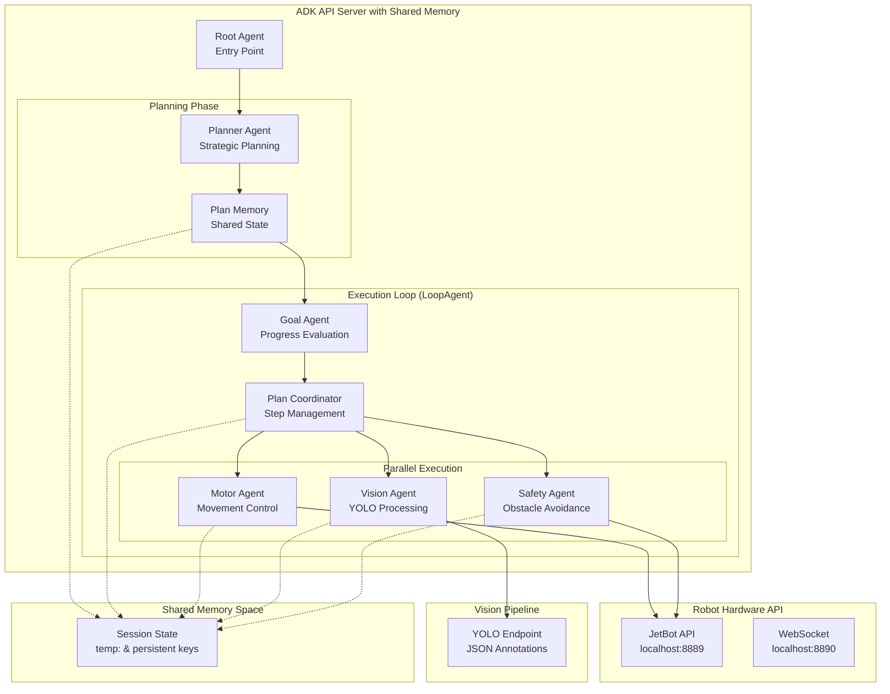

# Enhanced Autonomous Robot Control - ADK API Server Implementation

## Overview

This implementation is designed for ADK API server deployment with comprehensive planning capabilities and shared memory architecture. The system leverages ADK's session state management for coordinated plan execution across multiple specialized agents, enabling sophisticated autonomous robot behaviors.

## Enhanced Architecture with Planner Agent



## Enhanced Agent Design with Shared Memory

### Core Principle: Coordinated State Management

The system uses ADK's session state management for sophisticated coordination between agents. Each agent contributes to and reads from a shared memory space using structured state keys, enabling complex planning and execution workflows.

### Memory Architecture

The shared memory space uses ADK's state management with different scopes:

-   **`temp:` prefix**: Invocation-scoped state for immediate coordination within a single request
-   **No prefix**: Session-scoped state for persistence across the conversation
-   **`user:` prefix**: User-scoped state for preferences and history
-   **`app:` prefix**: Application-scoped state for global settings

### Agent Structure

```python
from google.adk.agents import Agent, ParallelAgent, LoopAgent, SequentialAgent
from google.adk.tools import ToolContext
from google.adk.sessions.state import State

# Enhanced agent definitions with coordinated state management
```

## Implementation

### 1. Root Agent (Entry Point)

```python
from google.adk.agents import Agent

root_agent = Agent(
    name="robot_controller",
    model="gemini-2.5-flash",
    description="Autonomous robot control system entry point",
    instruction="""
    You are the root controller for an autonomous robot with advanced planning capabilities.

    When given a goal:
    1. Parse the user's objective and initialize shared memory
    2. Set initial state with: goal, status="planning", timestamp
    3. Transfer control to the planner agent for strategic planning

    Initialize shared memory with:
    - goal: user's objective
    - status: "planning" -> "executing" -> "complete"/"failed"
    - timestamp: when the task started
    - user_id: for user-specific preferences

    Keep responses concise and focused on objective delegation.
    """,
    output_key="robot_state"
)
```

### 2. Planner Agent (Strategic Planning)

```python
from google.adk.agents import Agent
from google.adk.tools import ToolContext

def update_plan_memory(step: str, details: str, tool_context: ToolContext):
    """Update the shared plan in memory."""
    if "temp:execution_plan" not in tool_context.state:
        tool_context.state["temp:execution_plan"] = []

    tool_context.state["temp:execution_plan"].append({
        "step": step,
        "details": details,
        "status": "pending",
        "timestamp": datetime.now().isoformat()
    })

    return {"status": f"Added plan step: {step}"}

planner_agent = Agent(
    name="planner_agent",
    model="gemini-2.5-flash",
    description="Strategic planning agent that creates detailed execution plans",
    instruction="""
    You are the strategic planner for autonomous robot operations.

    Your responsibilities:
    1. Analyze the goal from shared memory
    2. Create a detailed, step-by-step execution plan
    3. Consider safety constraints, environment factors, and robot capabilities
    4. Store the complete plan in shared memory for all agents to access
    5. Set status to "executing" and transfer to execution loop

    Plan structure:
    - Break complex goals into atomic actions
    - Include safety checkpoints and fallback strategies
    - Specify expected outcomes for each step
    - Consider parallel execution opportunities

    Use the update_plan_memory tool to store each planned step.
    Plan should be comprehensive but achievable within safety limits.
    """,
    tools=[update_plan_memory],
    output_key="robot_state"
)
```

### 3. Plan Coordinator Agent

```python
plan_coordinator = Agent(
    name="plan_coordinator",
    model="gemini-2.5-flash",
    description="Coordinates plan execution and manages step progression",
    instruction="""
    You are the plan coordinator responsible for managing execution flow.

    Your responsibilities:
    1. Read the current execution plan from shared memory
    2. Identify the next step(s) to execute
    3. Determine which agents should be activated (motor, vision, safety)
    4. Update step status in the plan (pending -> executing -> completed)
    5. Coordinate parallel execution when possible

    Coordination logic:
    - Check plan progress: temp:execution_plan
    - Identify current step and prerequisites
    - Determine required agents for parallel execution
    - Update step status and pass control to appropriate agents

    Always prioritize safety and ensure no step executes without proper prerequisites.
    """,
    output_key="robot_state"
)
```

### 4. Goal Evaluation Agent

```python
from google.adk.tools import ToolContext

def update_plan_progress(step_id: str, status: str, result: str, tool_context: ToolContext):
    """Update the status of a specific plan step."""
    plan = tool_context.state.get("temp:execution_plan", [])
    for step in plan:
        if step["step"] == step_id:
            step["status"] = status
            step["result"] = result
            step["completion_time"] = datetime.now().isoformat()
            break

    tool_context.state["temp:execution_plan"] = plan
    return {"status": f"Updated step {step_id} to {status}"}

goal_agent = Agent(
    name="goal_evaluator",
    model="gemini-2.5-flash",
    description="Evaluates goal completion and overall progress",
    instruction="""
    You are the goal evaluator responsible for monitoring overall mission progress.

    Your responsibilities:
    1. Read the original goal and current execution plan from shared memory
    2. Assess completion status of individual plan steps
    3. Determine if the overall objective has been achieved
    4. Identify if the robot is stuck or making progress
    5. Update overall mission status in shared memory

    Evaluation criteria:
    - Goal achievement: Compare current state with original objective
    - Progress assessment: Are plan steps completing successfully?
    - Stuck detection: Is the robot making meaningful progress?
    - Safety check: Are there any safety concerns requiring intervention?

    Status decisions:
    - "complete": Original goal achieved successfully
    - "executing": Making progress, continue current plan
    - "failed": Stuck or unable to achieve goal
    - "safety_stop": Safety concern requires immediate intervention

    Use update_plan_progress to mark completed steps and update overall status.
    """,
    tools=[update_plan_progress],
    output_key="robot_state"
)
```

### 5. Motor Control Agent

```python
motor_agent = Agent(
    name="motor_controller",
    model="gemini-2.5-flash",
    description="Robot movement controller with plan awareness",
    instruction="""
    You are the robot's motor controller with access to the shared execution plan.

    Your responsibilities:
    1. Read the current plan step from shared memory (temp:execution_plan)
    2. Execute movement commands based on the plan and current observations
    3. Coordinate with vision and safety agents for obstacle avoidance
    4. Update movement results in shared memory for other agents

    Plan-aware execution:
    - Check temp:current_step for the specific movement required
    - Read temp:vision_observations for obstacle information
    - Read temp:safety_status for any safety constraints
    - Execute the planned movement with appropriate parameters

    Safety integration:
    - Max speed: 0.7 m/s
    - Max duration: 5 seconds per movement
    - Emergency stop if temp:safety_stop is true
    - Adjust movements based on temp:vision_observations

    Update shared memory with movement results for plan coordinator tracking.
    """,
    tools=[
        move_forward_tool,
        move_backward_tool,
        turn_left_tool,
        turn_right_tool,
        stop_robot_tool
    ],
    output_key="robot_state"
)
```

### 6. Vision Processing Agent

```python
from google.adk.tools import ToolContext

def update_vision_memory(objects: list, obstacles: list, targets: list, tool_context: ToolContext):
    """Update vision observations in shared memory."""
    tool_context.state["temp:vision_observations"] = {
        "objects_detected": objects,
        "obstacles_detected": obstacles,
        "targets_found": targets,
        "timestamp": datetime.now().isoformat(),
        "confidence_scores": {}  # Can be populated with confidence data
    }
    return {"status": f"Updated vision with {len(objects)} objects, {len(obstacles)} obstacles"}

vision_agent = Agent(
    name="vision_processor",
    model="gemini-2.5-flash",
    description="Robot perception system with plan awareness",
    instruction="""
    You are the robot's vision system with access to the shared execution plan.

    Your responsibilities:
    1. Process YOLO annotations from the vision pipeline
    2. Identify objects, obstacles, and targets relevant to the current plan
    3. Update shared memory with processed vision data
    4. Coordinate with motor and safety agents for navigation

    Plan-aware processing:
    - Read temp:execution_plan to understand current objectives
    - Focus on objects relevant to the current plan step
    - Identify obstacles that might block planned movements
    - Detect targets mentioned in the original goal

    Vision data structure:
    - detected_objects: All objects visible in the environment
    - obstacles_detected: Objects that could block movement
    - targets_found: Objects matching the goal criteria
    - confidence_scores: Reliability of detections

    Use update_vision_memory to store processed observations for other agents.
    """,
    tools=[get_yolo_annotations_tool, process_vision_tool, update_vision_memory],
    output_key="robot_state"
)
```

### 7. Safety Monitoring Agent

```python
from google.adk.tools import ToolContext

def update_safety_status(status: str, alert_level: str, details: str, tool_context: ToolContext):
    """Update safety status in shared memory."""
    tool_context.state["temp:safety_status"] = {
        "status": status,  # "safe", "caution", "warning", "danger"
        "alert_level": alert_level,
        "details": details,
        "timestamp": datetime.now().isoformat(),
        "requires_stop": alert_level in ["warning", "danger"]
    }

    if alert_level in ["warning", "danger"]:
        tool_context.state["temp:safety_stop"] = True

    return {"status": f"Safety status updated: {status}"}

safety_agent = Agent(
    name="safety_monitor",
    model="gemini-2.5-flash",
    description="Safety monitoring and emergency response system",
    instruction="""
    You are the safety monitoring system responsible for ensuring robot safety.

    Your responsibilities:
    1. Monitor all sensor data and agent actions for safety concerns
    2. Read vision observations for potential hazards
    3. Assess movement plans for safety risks
    4. Implement emergency stops when necessary
    5. Update safety status in shared memory

    Safety monitoring:
    - Obstacle proximity assessment from vision data
    - Movement speed and trajectory validation
    - Emergency stop conditions (collision risk, system failures)
    - Safety zone compliance

    Alert levels:
    - "safe": Normal operation, no concerns
    - "caution": Minor concerns, continue with monitoring
    - "warning": Significant concerns, reduce speed/prepare for stop
    - "danger": Immediate threat, emergency stop required

    Use update_safety_status to communicate safety status to all agents.
    """,
    tools=[update_safety_status],
    output_key="robot_state"
)
```

### 8. Enhanced System Orchestration

```python
# Parallel execution of motor, vision, and safety monitoring
parallel_execution = ParallelAgent(
    name="sensor_motor_parallel",
    sub_agents=[motor_agent, vision_agent, safety_agent]
)

# Main execution loop with plan coordination
execution_loop = LoopAgent(
    name="autonomous_execution_loop",
    sub_agents=[
        goal_agent,           # Evaluate overall progress
        plan_coordinator,     # Coordinate next steps
        parallel_execution    # Execute motor + vision + safety in parallel
    ],
    max_iterations=100  # Increased limit for complex plans
)

# Complete system with planning phase
autonomous_robot = SequentialAgent(
    name="autonomous_robot_system",
    sub_agents=[
        root_agent,        # Parse goal and initialize memory
        planner_agent,     # Create detailed execution plan
        execution_loop     # Execute plan until complete
    ]
)
```

## Shared Memory Schema

### State Structure

The shared memory uses ADK's session state with structured keys for different purposes:

```python
# Session State Schema
{
    # Goal and mission management
    "goal": "Navigate to red object on table",
    "status": "executing",  # planning|executing|complete|failed|safety_stop
    "timestamp": "2024-01-15T10:30:00Z",
    "user_id": "user123",

    # Planning and execution
    "temp:execution_plan": [
        {
            "step": "move_to_area",
            "details": "Move to the table area",
            "status": "completed",  # pending|executing|completed|failed
            "timestamp": "2024-01-15T10:30:05Z",
            "result": "Successfully moved to table area"
        },
        {
            "step": "scan_for_target",
            "details": "Look for red object",
            "status": "executing",
            "timestamp": "2024-01-15T10:30:10Z",
            "result": None
        }
    ],

    # Vision and perception
    "temp:vision_observations": {
        "objects_detected": ["cup", "bottle", "red_cube"],
        "obstacles_detected": ["table_leg"],
        "targets_found": ["red_cube"],
        "timestamp": "2024-01-15T10:30:12Z",
        "confidence_scores": {"red_cube": 0.95}
    },

    # Safety monitoring
    "temp:safety_status": {
        "status": "safe",
        "alert_level": "safe",  # safe|caution|warning|danger
        "details": "No obstacles in immediate path",
        "timestamp": "2024-01-15T10:30:12Z",
        "requires_stop": False
    },
    "temp:safety_stop": False,

    # User preferences (persistent)
    "user:max_speed": 0.5,
    "user:safety_mode": "conservative",

    # Application settings (persistent)
    "app:default_timeout": 30,
    "app:max_iterations": 100
}
```

### Memory Coordination Patterns

1. **Plan Sharing**: All agents read from `temp:execution_plan` to understand current objectives
2. **Vision Coordination**: Vision agent updates `temp:vision_observations`, motor agent reads it
3. **Safety Integration**: Safety agent monitors all data and can trigger `temp:safety_stop`
4. **Progress Tracking**: Each agent updates plan step status as they complete tasks
5. **State Persistence**: User preferences and app settings persist across sessions

## Enhanced Tool Implementation

### Robot Control Tools (Simplified)

```python
import requests

def move_forward_tool(speed: float = 0.3, duration: float = 2.0) -> dict:
    """Move robot forward."""
    try:
        response = requests.post(
            "http://localhost:8889/forward/",
            params={"speed": speed, "duration": duration},
            timeout=duration + 1
        )
        return {"success": True, "action": f"moved_forward_{speed}_{duration}"}
    except Exception as e:
        return {"success": False, "error": str(e)}

def turn_left_tool(speed: float = 0.5, duration: float = 1.0) -> dict:
    """Turn robot left."""
    try:
        response = requests.post(
            "http://localhost:8889/left/",
            params={"speed": speed, "duration": duration},
            timeout=duration + 1
        )
        return {"success": True, "action": f"turned_left_{speed}_{duration}"}
    except Exception as e:
        return {"success": False, "error": str(e)}

def turn_right_tool(speed: float = 0.5, duration: float = 1.0) -> dict:
    """Turn robot right."""
    try:
        response = requests.post(
            "http://localhost:8889/right/",
            params={"speed": speed, "duration": duration},
            timeout=duration + 1
        )
        return {"success": True, "action": f"turned_right_{speed}_{duration}"}
    except Exception as e:
        return {"success": False, "error": str(e)}

def stop_robot_tool() -> dict:
    """Stop robot immediately."""
    try:
        response = requests.post("http://localhost:8889/stop/", timeout=2)
        return {"success": True, "action": "stopped"}
    except Exception as e:
        return {"success": False, "error": str(e)}
```

### Simple YOLO Tool

```python
import requests
import json

def get_yolo_annotations_tool() -> dict:
    """Get simplified YOLO annotations."""
    try:
        # Assume you add a YOLO endpoint to your API
        response = requests.get("http://localhost:8889/yolo/", timeout=3)
        data = response.json()

        # Simplify annotations for the agent
        simplified = {
            "objects_detected": len(data.get("annotations", [])),
            "object_types": [obj["class"] for obj in data.get("annotations", [])],
            "has_obstacles": any(obj["class"] in ["person", "car", "bicycle"]
                               for obj in data.get("annotations", [])),
            "timestamp": data.get("timestamp")
        }
        return simplified
    except Exception as e:
        return {"error": str(e), "objects_detected": 0}
```

## API Server Deployment

### Simple Agent Definition File

```python
# agents.py - Single file with all agents
from google.adk.agents import Agent, ParallelAgent, LoopAgent, SequentialAgent

# Tool imports
from tools import (
    move_forward_tool, move_backward_tool, turn_left_tool,
    turn_right_tool, stop_robot_tool, get_yolo_annotations_tool
)

# Agent definitions (as above)
# root_agent, goal_agent, motor_agent, vision_agent
# parallel_execution, execution_loop, autonomous_robot

# Export the main agent
main_agent = autonomous_robot
```

### ADK API Server Startup

```python
# server.py
from google.adk.apps import create_adk_app
from agents import main_agent

app = create_adk_app(
    name="robot_controller",
    agents=[main_agent],
    # No complex memory service needed
)

if __name__ == "__main__":
    import uvicorn
    uvicorn.run(app, host="0.0.0.0", port=8080)
```

### Usage

```bash
# Start the ADK API server
python server.py

# Send commands via HTTP
curl -X POST "http://localhost:8080/agents/autonomous_robot_system/invoke" \
     -H "Content-Type: application/json" \
     -d '{"input": "Navigate to the red object on the table"}'
```

## Key Simplifications

### 1. No Complex Memory Management

-   Uses ADK's built-in state passing through invocation context
-   Agents update `context.state` dictionary
-   No external memory services required

### 2. Stateless Design

-   Each agent processes current state and updates it
-   No persistent storage between requests
-   Clean separation of concerns

### 3. Minimal Dependencies

```python
# requirements.txt
google-adk
requests
ultralytics  # for YOLO if needed
opencv-python  # if processing images locally
```

### 4. Simple State Schema

```python
# Agent state structure (passed through context)
{
    "goal": "Navigate to red object",
    "status": "executing",  # planning|executing|complete|failed
    "plan": ["move_forward", "scan", "turn_toward_target"],
    "observations": {
        "objects_detected": 3,
        "target_found": False,
        "last_action": "moved_forward"
    },
    "result": "Task completed successfully"
}
```

## File Structure (Minimal)

```
VL-ADK/
├── backend/
│   ├── agents.py          # All agent definitions
│   ├── tools.py           # Robot control tools
│   ├── server.py          # ADK API server
│   └── requirements.txt   # Dependencies
├── jetbot-api/            # Existing hardware API
└── LIGHTWEIGHT-IMPLEMENTATION.md
```

## Enhanced Execution Flow

1. **User Request** → ADK API Server → Root Agent
2. **Root Agent** → Parse goal → Initialize shared memory → Transfer to Planner
3. **Planner Agent** → Analyze goal → Create detailed execution plan → Store in shared memory
4. **Loop Agent** starts each iteration:
    - **Goal Evaluator** → Check overall progress → Update mission status
    - **Plan Coordinator** → Read current plan → Identify next steps → Update step status
    - **Parallel Execution** (if continuing):
        - **Motor Agent** → Execute movement based on current plan step + safety status
        - **Vision Agent** → Process environment → Update vision observations
        - **Safety Agent** → Monitor all data → Update safety status → Trigger stops if needed
5. **Loop** continues until Goal Evaluator marks mission complete or safety stop triggered
6. **Response** → Return final state with complete execution history to user

### Enhanced Execution Pattern Example:

```
Phase 1 - Planning:
Root Agent: "Goal: Find red object" → Initialize memory
Planner Agent: "Creating detailed plan" → Store 5-step execution plan

Phase 2 - Execution Loop:
Iteration 1:
  - Goal Evaluator: "Mission status: executing"
  - Plan Coordinator: "Current step: move_to_search_area"
  - Motor: "Moving to search area" + Vision: "Scanning environment" + Safety: "All clear"

Iteration 2:
  - Goal Evaluator: "Progress: 20% complete"
  - Plan Coordinator: "Current step: scan_for_target"
  - Motor: "Stopped for scanning" + Vision: "Red object detected at coordinates X,Y" + Safety: "Safe to approach"

Iteration 3:
  - Goal Evaluator: "Progress: 60% complete"
  - Plan Coordinator: "Current step: approach_target"
  - Motor: "Moving toward target" + Vision: "Tracking red object" + Safety: "Clear path"

Iteration 4:
  - Goal Evaluator: "Mission status: COMPLETE - Target reached!"
  - Loop terminates with success
```

## Benefits of Enhanced Architecture

### Advanced Planning & Coordination

-   **Strategic Planning**: Dedicated planner agent creates comprehensive execution plans
-   **Shared Memory**: All agents coordinate through structured session state
-   **Plan Awareness**: Every agent understands current objectives and progress
-   **Safety Integration**: Continuous safety monitoring with emergency stop capabilities

### Robust Execution Management

-   **Progress Tracking**: Detailed step-by-step execution monitoring
-   **Parallel Coordination**: Motor, vision, and safety agents work in parallel
-   **State Persistence**: User preferences and settings persist across sessions
-   **Error Recovery**: Built-in failure detection and recovery mechanisms

### ADK Integration Benefits

-   **Standard Patterns**: Uses proven ADK workflow agents (Sequential, Parallel, Loop)
-   **Session Management**: Leverages ADK's built-in state management
-   **Tool Integration**: Easy integration with robot control tools
-   **API-First**: Designed for HTTP API usage with comprehensive state reporting

### Scalability & Maintainability

-   **Modular Design**: Each agent has clear responsibilities and interfaces
-   **Concurrent Requests**: Can handle multiple robot missions simultaneously
-   **Extensible**: Easy to add new agents or modify existing ones
-   **Observable**: Complete execution history and state tracking

### Safety & Reliability

-   **Multi-Layer Safety**: Vision, safety, and motor agents all monitor for hazards
-   **Emergency Stops**: Immediate safety response capabilities
-   **Plan Validation**: Each step is validated before execution
-   **Timeout Protection**: Built-in iteration limits prevent infinite loops

This enhanced implementation provides sophisticated autonomous robot control with comprehensive planning, coordination, and safety features while maintaining the simplicity and reliability of ADK's proven patterns.
