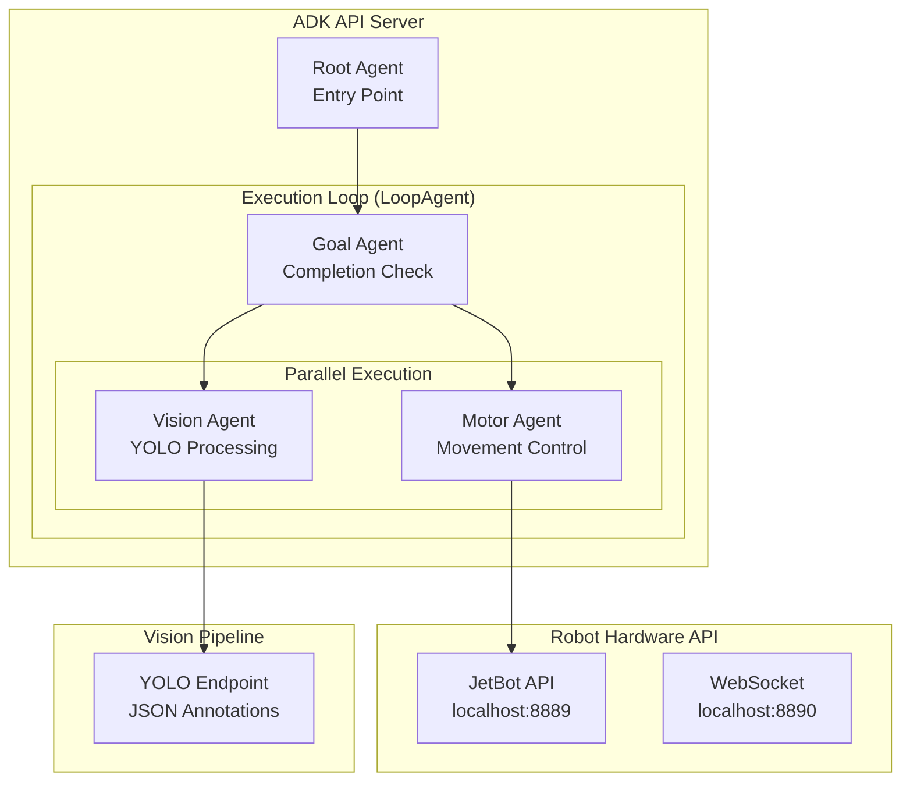

# Lightweight Autonomous Robot Control - ADK API Server Implementation

## Overview

This is a simplified implementation designed for ADK API server deployment with minimal overhead. The system uses basic agent state sharing through the invocation context rather than complex memory services.

## Simplified Architecture



## Lightweight Agent Design

### Core Principle: Stateless Agents with Context Passing

Instead of complex memory management, agents pass state through the invocation context's `state` dictionary, which is automatically managed by ADK.

### Agent Structure

```python
from google.adk.agents import Agent, ParallelAgent, LoopAgent, SequentialAgent

# Minimal agent definitions with state passing through context
```

## Implementation

### 1. Root Agent (Entry Point)
```python
from google.adk.agents import Agent

root_agent = Agent(
    name="robot_controller",
    model="gemini-2.5-flash", 
    description="Autonomous robot control system entry point",
    instruction="""
    You are the root controller for an autonomous robot.
    
    When given a goal:
    1. Parse the user's objective and create an initial plan
    2. Set the initial state with: goal, plan, status="executing"
    3. Pass control to the execution loop
    
    State format to maintain:
    - goal: user's objective
    - plan: simple list of actions to achieve goal
    - status: current system status
    - observations: current environment state
    - result: final outcome
    
    Create a simple plan with 3-5 basic actions like:
    ["move_forward", "scan_for_target", "turn_toward_object", "approach_target"]
    
    Keep responses concise and focused on the objective.
    """,
    output_key="robot_state"
)
```

### 2. Goal Checker Agent
```python
goal_agent = Agent(
    name="goal_checker",
    model="gemini-2.5-flash",
    description="Evaluates goal completion and progress", 
    instruction="""
    You are the goal evaluator. Check if the objective is complete each loop iteration.
    
    Compare the original goal with current observations:
    1. Has the goal been achieved?
    2. Is progress being made?
    3. Should execution continue or stop?
    
    If goal complete: set status="complete", escalate=True
    If stuck/failed: set status="failed", escalate=True  
    If continuing: set status="executing", escalate=False
    
    Be decisive - avoid infinite loops. Check progress against the plan.
    """,
    output_key="robot_state"
)
```

### 3. Motor Agent
```python
motor_agent = Agent(
    name="motor_controller",
    model="gemini-2.5-flash",
    description="Robot movement controller",
    instruction="""
    You are the robot's motor controller. Execute movement commands based on the plan and observations.
    
    Look at the current plan and observations to determine the next movement:
    1. Check for obstacles in vision observations
    2. Execute the next logical movement step from the plan
    3. Update observations with movement results
    
    Safety rules:
    - Max speed: 0.7
    - Max duration: 5 seconds per movement
    - Stop if obstacles detected
    - Adjust movements based on vision feedback
    """,
    tools=[
        move_forward_tool,
        move_backward_tool,
        turn_left_tool, 
        turn_right_tool,
        stop_robot_tool
    ],
    output_key="robot_state"
)
```

### 4. Vision Agent
```python
vision_agent = Agent(
    name="vision",
    model="gemini-2.5-flash", 
    description="Robot perception system",
    instruction="""
    You are the robot's vision system. Process visual information.
    
    Use YOLO annotations to:
    1. Identify objects and obstacles
    2. Locate targets mentioned in the goal
    3. Update observations with current environment state
    
    Focus on objects relevant to the current goal.
    Update observations with: detected_objects, obstacles, target_found
    """,
    tools=[get_yolo_annotations_tool, process_vision_tool],
    output_key="robot_state"
)
```

### 5. System Orchestration
```python
# Parallel execution of motor and vision
parallel_execution = ParallelAgent(
    name="motor_vision_parallel",
    sub_agents=[motor_agent, vision_agent]
)

# Main execution loop - Goal agent first, then parallel execution
execution_loop = LoopAgent(
    name="autonomous_execution_loop", 
    sub_agents=[
        goal_agent,        # Check completion first each iteration
        parallel_execution # Then execute motor + vision in parallel
    ],
    max_iterations=50  # Safety limit
)

# Complete system
autonomous_robot = SequentialAgent(
    name="autonomous_robot_system",
    sub_agents=[
        root_agent,        # Parse goal and create initial plan
        execution_loop     # Execute until complete
    ]
)
```

## Minimal Tool Implementation

### Robot Control Tools (Simplified)
```python
import requests

def move_forward_tool(speed: float = 0.3, duration: float = 2.0) -> dict:
    """Move robot forward."""
    try:
        response = requests.post(
            "http://localhost:8889/forward/",
            params={"speed": speed, "duration": duration},
            timeout=duration + 1
        )
        return {"success": True, "action": f"moved_forward_{speed}_{duration}"}
    except Exception as e:
        return {"success": False, "error": str(e)}

def turn_left_tool(speed: float = 0.5, duration: float = 1.0) -> dict:
    """Turn robot left."""
    try:
        response = requests.post(
            "http://localhost:8889/left/", 
            params={"speed": speed, "duration": duration},
            timeout=duration + 1
        )
        return {"success": True, "action": f"turned_left_{speed}_{duration}"}
    except Exception as e:
        return {"success": False, "error": str(e)}

def turn_right_tool(speed: float = 0.5, duration: float = 1.0) -> dict:
    """Turn robot right."""
    try:
        response = requests.post(
            "http://localhost:8889/right/",
            params={"speed": speed, "duration": duration}, 
            timeout=duration + 1
        )
        return {"success": True, "action": f"turned_right_{speed}_{duration}"}
    except Exception as e:
        return {"success": False, "error": str(e)}

def stop_robot_tool() -> dict:
    """Stop robot immediately."""
    try:
        response = requests.post("http://localhost:8889/stop/", timeout=2)
        return {"success": True, "action": "stopped"}
    except Exception as e:
        return {"success": False, "error": str(e)}
```

### Simple YOLO Tool
```python
import requests
import json

def get_yolo_annotations_tool() -> dict:
    """Get simplified YOLO annotations."""
    try:
        # Assume you add a YOLO endpoint to your API
        response = requests.get("http://localhost:8889/yolo/", timeout=3)
        data = response.json()
        
        # Simplify annotations for the agent
        simplified = {
            "objects_detected": len(data.get("annotations", [])),
            "object_types": [obj["class"] for obj in data.get("annotations", [])],
            "has_obstacles": any(obj["class"] in ["person", "car", "bicycle"] 
                               for obj in data.get("annotations", [])),
            "timestamp": data.get("timestamp")
        }
        return simplified
    except Exception as e:
        return {"error": str(e), "objects_detected": 0}
```

## API Server Deployment

### Simple Agent Definition File
```python
# agents.py - Single file with all agents
from google.adk.agents import Agent, ParallelAgent, LoopAgent, SequentialAgent

# Tool imports
from tools import (
    move_forward_tool, move_backward_tool, turn_left_tool, 
    turn_right_tool, stop_robot_tool, get_yolo_annotations_tool
)

# Agent definitions (as above)
# root_agent, goal_agent, motor_agent, vision_agent
# parallel_execution, execution_loop, autonomous_robot

# Export the main agent
main_agent = autonomous_robot
```

### ADK API Server Startup
```python
# server.py
from google.adk.apps import create_adk_app
from agents import main_agent

app = create_adk_app(
    name="robot_controller",
    agents=[main_agent],
    # No complex memory service needed
)

if __name__ == "__main__":
    import uvicorn
    uvicorn.run(app, host="0.0.0.0", port=8080)
```

### Usage
```bash
# Start the ADK API server
python server.py

# Send commands via HTTP
curl -X POST "http://localhost:8080/agents/autonomous_robot_system/invoke" \
     -H "Content-Type: application/json" \
     -d '{"input": "Navigate to the red object on the table"}'
```

## Key Simplifications

### 1. No Complex Memory Management
- Uses ADK's built-in state passing through invocation context
- Agents update `context.state` dictionary
- No external memory services required

### 2. Stateless Design  
- Each agent processes current state and updates it
- No persistent storage between requests
- Clean separation of concerns

### 3. Minimal Dependencies
```python
# requirements.txt
google-adk
requests
ultralytics  # for YOLO if needed
opencv-python  # if processing images locally
```

### 4. Simple State Schema
```python
# Agent state structure (passed through context)
{
    "goal": "Navigate to red object",
    "status": "executing",  # planning|executing|complete|failed
    "plan": ["move_forward", "scan", "turn_toward_target"],
    "observations": {
        "objects_detected": 3,
        "target_found": False,
        "last_action": "moved_forward"
    },
    "result": "Task completed successfully"
}
```

## File Structure (Minimal)
```
VL-ADK/
├── backend/
│   ├── agents.py          # All agent definitions
│   ├── tools.py           # Robot control tools  
│   ├── server.py          # ADK API server
│   └── requirements.txt   # Dependencies
├── jetbot-api/            # Existing hardware API
└── LIGHTWEIGHT-IMPLEMENTATION.md
```

## Execution Flow (Optimized)

1. **User Request** → ADK API Server → Root Agent
2. **Root Agent** → Parse goal → Create initial plan → Initialize state  
3. **Loop Agent** starts each iteration:
   - **Goal Agent** → Check if complete → Escalate if done
   - **Parallel Execution** (if continuing):
     - **Motor Agent** → Execute movement based on plan + observations
     - **Vision Agent** → Process environment and update observations
4. **Loop** continues until Goal Agent escalates or max iterations reached
5. **Response** → Return final state with result to user

### Execution Pattern Example:
```
Iteration 1: Goal Agent: "Not complete" → Motor: "move_forward" + Vision: "scan_environment"
Iteration 2: Goal Agent: "Still searching" → Motor: "turn_left" + Vision: "red_object_detected"  
Iteration 3: Goal Agent: "Target found, approaching" → Motor: "approach_target" + Vision: "track_object"
Iteration 4: Goal Agent: "COMPLETE - at target!" → ESCALATE=True → Loop stops
```

## Benefits of This Approach

- **Minimal Overhead**: No complex memory management
- **Out-of-the-box ADK**: Uses standard agent patterns
- **Stateless**: Each request is independent
- **Scalable**: Can handle multiple concurrent requests
- **Simple**: Easy to understand and maintain
- **API-first**: Designed for HTTP API usage

This lightweight implementation gives you autonomous robot control with minimal complexity while leveraging ADK's powerful workflow capabilities through the API server.